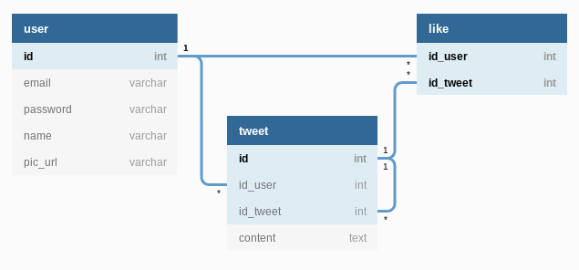

# README

_(in progress)_

---

## ¿Qué es Zwitscher?
Zwitscher es un clon de Twitter, desarollado en Ruby on Rails para la prueba del modulo 4 del curso "Fullstack developent" de Desafío Latam, generación 39.

La palabra es alemán y signífica "gorjear".

## Heroku
Zwitscher está disponible en heroku: https://zwitscher.herokuapp.com/

## Historia 1
> * El modelo debe llamarse user.
> * La visita al registrarse debe ingresar nombre usuario, foto de perfil (url), email y password.


### 1. Agregar devise al Gemfile
Para la autenticación en este proyecto se usa `devise`.
```ruby
# use devise for authentication
gem 'devise'
```
### 2. Instalar devise
```bash
rails devise:install
```
### 3. Generar el modelo `user`
Por defecto viene con los campos `password` y `email`.
```bash
rails g devise user
```
### 4. Agregar los campos para el nombre usuario y foto de perfil al modelo
```
rails g migration AddUserAndPictureToUser name pic_url
rails db:migrate
```

### 5. Agregar los campos a los formularios
Primero hay que generar las vistas y controladores de devise y después se puede editarlos para agregar los campos adicionales.
```bash
rails g devise:views users
rails g devise:controllers users
```
#### Views
A las vistas
* `app/views/users/registrations/new.html.erb`
* `app/views/users/registrations/edit.html.erb`

hay que agregar los dos campos nuevos:

```erb
<div class="form-group">
  <%= f.label :name %>
  <%= f.text_field :name, autofocus: true, autocomplete: "name", class: "form-control" %>
</div>

<div class="form-group">
  <%= f.label :pic_url %>
  <%= f.text_field :pic_url, autocomplete: "profile picture URL", class: "form-control" %>
</div>
```

#### Controllers
En el controlador
* `app/controllers/users/registrations_controller.rb`

hay que agregar/habilitar las siguientes líneas:

```ruby
class Users::RegistrationsController < Devise::RegistrationsController
  before_action :configure_sign_up_params, only: [:create]
  before_action :configure_account_update_params, only: [:update]

  protected

  # If you have extra params to permit, append them to the sanitizer.
  def configure_sign_up_params
    devise_parameter_sanitizer.permit(:sign_up, keys: [:name, :pic_url])
  end

  # If you have extra params to permit, append them to the sanitizer.
  def configure_account_update_params
    devise_parameter_sanitizer.permit(:account_update, keys: [:name, :pic_url])
  end
```

> * Una visita debe poder registrarse utilizando el link de registro en la barra de navegación.

La acción para registrarse (crear un nuevo usuario) es `users#registrations#new`, así que hay que agregar un link al layout:

```erb
<%= link_to "Sign Up", new_user_registration_path %>
```

> * Si una visita ya tiene usuario deberá utilizar el link de ingreso y llenará los campos: email y password antes de hacer click en ingresar.

El link para el login se agrega así:

```erb
<%= link_to "Sign In", new_user_session_path %>
```

> * Al registrarse o ingresar se le debe redirigir a la página de inicio y mostrar una alerta con el mensaje de "bienvenido".

Para mostrar alertas, hay que agregar los siguientes elementos al layout `app/views/layouts/application.html.erb`

```erb
<% if notice %>
    <%= notice %>
<% end %>
<% if alert %>
    <%= alert %>
<% end %>
```

Ahora, para cambiar los mensajes, se puede cambiar los textos en `config/locales/devise.en.yml`:

```ruby
signed_in: "bienvenido"
signed_out: "chao"
```

## Historia 2
> * Una visita debe poder entrar a la página de inicio y ver los últimos 50 tweets.
> * Cada tweet debe mostrar el contenido, la foto del autor (url a la foto), la cantidad de likes y la cantidad de retweets.
> * Los modelos debe llamarse tweet y like.

Al final, el modelo se ve así:



## Historia 3
> * Estos tweets deben estar paginados y debe haber un link llamado "mostrar más tweets", al presionarlo nos llevará a los siguientes 50 tweets.

## Historia 4
> * Al principio de la página debe haber una formulario que nos permita ingresar un nuevo tweet, al crear un tweet el usuario será redirigido a la página de inicio.
> * El formulario solo debe mostarse a los usuarios y no a las visitas.
> * Se debe validar que el tweet tenga contenido.

## Historia 5
> * Un usuario puede hacer like en un tweet, al hacerlo será redirigido a la página de inicio
> * Se debe mostrar un icono distinto para cuando un usuario ha hecho like.
> * Un usuario no puede hacer dos likes sobre el mismo tweet. Por lo tanto, se le debe quitar el like en el caso de que vuelva a hacer click en el botón.

## Historia 6
> * Un usuario puede hacer un retweet haciendo click en la acción rt (retweet) de un tweet, esto hará que ingrese un nuevo tweet con el mismo contenido pero además referenciando al tweet original.

## Historia 7
> * Haciendo click en la fecha del tweet se debe ir al detalle del tweet y dentro del detalle debe aparecer la foto de todas las personas que han dado like al tweet.
> * La fecha del tweet debe aparecer como tiempo en minutos desde la fecha de creación u horas si es mayor de 60 minutos.
> * Nota: El proyecto se debe publicar en heroku.